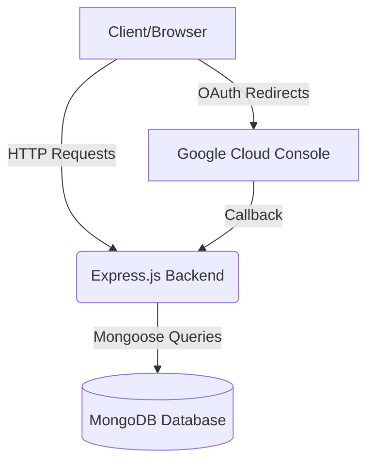

# Full-Stack Resume Builder

## Problem Statement
Creating professional, visually appealing, and ATS-friendly resumes is often a tedious process. This project solves this by providing a unified web platform that enables users to easily build, save, and manage their resumes dynamically. By instituting a streamlined authentication process and persistent database storage, users have continuous access to their historical professional data without fearing data loss.

## Architecture Diagram

## CI/CD Pipeline Explanation
The continuous integration and deployment pipeline operates through **Render**. Render continuously listens to webhooks triggered by pushes to the remote `main` branch on our GitHub repository. Once a commit is detected (like configuration changes or UI updates), Render automatically builds the node environment (executing `npm install` dynamically) and provisions the Express server without any manual intervention, ensuring zero-downtime rolling updates.

## Git Workflow Used
The project utilizes a structured **Feature Branching and Rebasing** workflow:
- Development is typically handled by creating separate branches or pulling targeted PRs.
- Interactive Rebasing (`git pull --rebase`) is used heavily to prevent unnecessary merge commit clutter and align parallel backend modifications (auth flows vs. db schemas).
- Conflicts are manually resolved on the developer's side before a fast-forward push aligns the remote branch.

## Tools Used
- **Frontend**: Vanilla HTML5, CSS3, JavaScript.
- **Backend Environment**: Node.js, Express.js.
- **Authentication**: Passport.js with Google OAuth 2.0 (`passport-google-oauth20`). 
- **Database**: MongoDB (Object modeling configured through `Mongoose`).
- **DevOps & Version Control**: Git, GitHub, Render (Hosting platform).

## Screenshots

*Note: Please replace the placeholder image paths below with actual screenshots.*

### Pipeline success

### Deployment output

## Challenges Faced
1. **Google OAuth Transitioning**: The application originally utilized client-side JavaScript popups for authentication. Converting this to a secure, server-side callback pipeline via Passport.js required completely rewriting the authentication logic and securely bridging frontend navigation states without causing CORS or verification payload errors.
2. **Merge Conflicts**: Rebasing remote branches produced large monolithic merge conflicts in vital operational files (`server.js`). This necessitated careful manual line-by-line conflict resolution to ensure database references weren't overwritten.
3. **Ghost Modules**: At one point, the local `node_modules` folder was accidentally committed to the remote repository which stalled the deployment. Resolving this required pruning the `.git` cache directly and setting up proper `.gitignore` protocols.